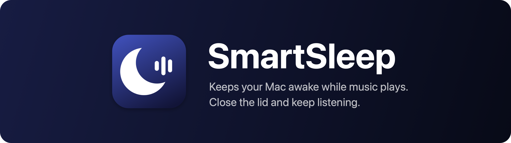
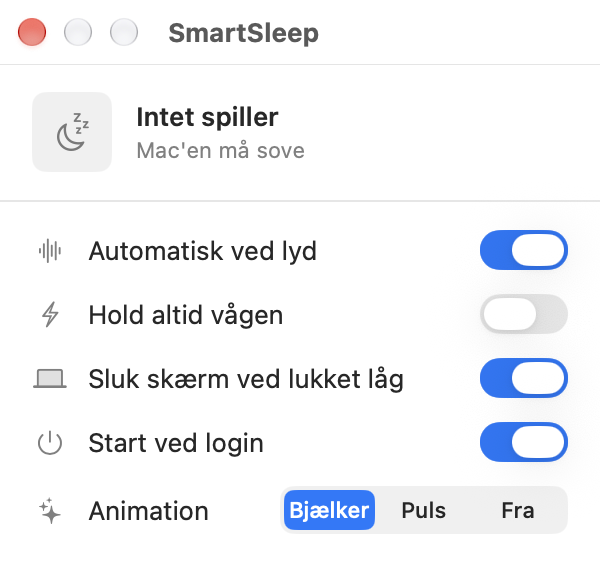
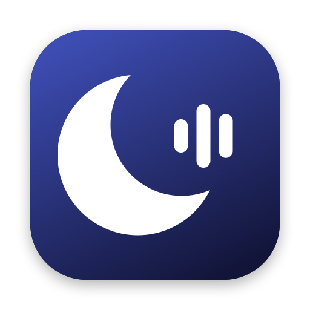
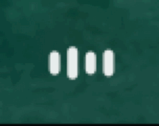

  

<h4 align="center">A macOS menu bar app that keeps your Mac awake while music plays, and turns the screen off when you close the lid.</h4>

  
  &nbsp;&nbsp;&nbsp;
  

  
  &nbsp;&nbsp;
  

## What it does

- When an app plays sound, the Mac stays awake. Close the lid and the music keeps going.
- If you close the lid while something plays, the screen turns off. It comes back at the same brightness when you open it.
- When the sound stops, the Mac sleeps normally again.
- The menu bar icon moves while music plays. The settings window shows what is playing, with the album cover from Spotify or the video thumbnail from YouTube in Brave.

## Requirements

An Apple Silicon Mac with macOS 14.2 or newer. It runs on macOS 12 and 13 too, but there it cannot tell which app is playing.

## Install

1. Download the DMG from [Releases](https://github.com/otto-BigO/smartsleep/releases).
2. Open it and drag SmartSleep to Applications.
3. The app is not notarized by Apple, so macOS blocks it the first time. Open **System Settings > Privacy & Security** and click **Open Anyway**.
4. On first launch SmartSleep asks for your password once. It adds one sudoers rule, `/etc/sudoers.d/smartsleep`, so the app can run `pmset -a disablesleep` without a password. That command is the only way to stop a Mac from sleeping when the lid closes. If you skip it, the Mac still stays awake while music plays, but only with the lid open.

## Build from source

Needs the Xcode Command Line Tools (`xcode-select --install`).

- `./install.sh` builds the app, copies it to `~/Applications` and starts it.
- `./build.sh` only builds it, to `build/SmartSleep.app`.
- `./make_dmg.sh` builds the DMG in `dist/`.

## Good to know

- If the app quits or crashes, the Mac does not get stuck awake. It resets `disablesleep` when it exits and again every time it starts.
- macOS asks once whether SmartSleep may control Spotify and Brave. That is only used to read the title and the cover.
- Logs: `/usr/bin/log stream --predicate 'subsystem == "com.personal.SmartSleep"'`
